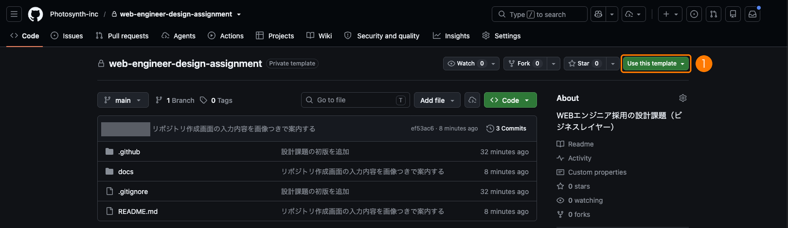
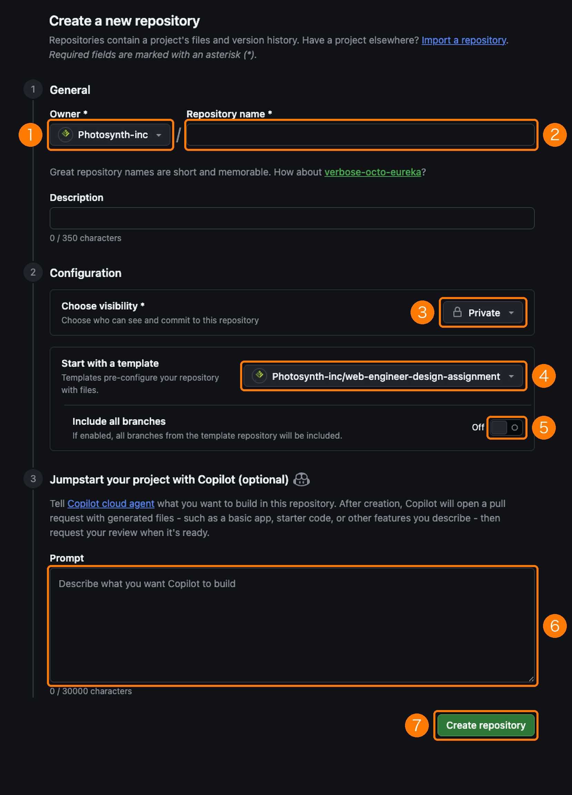

# Photosynth WEBエンジニア 設計課題

PhotosynthのWEBエンジニア採用で使う課題です。

選考の途中で、設計の考え方を見せていただきたい方にお願いしています。

このリポジトリには、課題の題材となるサービスの現状の仕様（スキーマとAPI）と、提出物であるADRのテンプレートが入っています。
**コードを書く必要はありません。**
現状の構造を読んだうえで、変更要求に対する設計の意思決定を文書として書いていただく課題です。

## この課題で見ること

実装力ではなく設計の判断と、その判断をチームに伝える力を見ます。
評価は次の観点を中心に行います。

- **案の詰め方**：変更要求に対して複数の案を立て、比較の軸を決め、根拠をつけて一つに絞れているか
- **案のレベル感**：出てきた案と考慮事項が、動いているシステムを壊さずに変える計画として成り立っているか
- **ADRの文書としての質**：読んだ人がその場で案を比べて意見を言える形になっているか

私たちのチームでは設計の判断をADRに書き、チームでレビューして合意してから実装に入ります。

この課題はその流れをそのまま選考に持ち込んだものです。

案の数や文章の長さではなく、案を比較した根拠と、制約をどう扱ったかが読み取れることを重視します。

要件に書かれていないことは、黙って決めずに、仮定を書いて進めるか、質問として残してください。

レビューではこちらの意見に同意することを求めていません。
理由があればこちらの意見に反対して構いません。

### AIツールの利用について

Copilot、Claude、ChatGPTなどのAIツールは使って構いません。

ただし、ADRの案と比較のうち、AIの提案をそのまま採ったものと、ご自身で判断したものが分かるように書いてください。

面接では、ご自身で判断した箇所を中心にお聞きします。

## 問題

### 背景

題材は、企業向けサービスの管理APIを小さくしたものです。
次のデータを扱っています。

- **組織（organizations）**：契約している顧客企業
- **利用者（users）**：組織に所属するスタッフ。`users.organization_id` で所属組織を一つ持ちます
- **拠点（sites）**：組織が管理する場所。利用者は、自分の所属組織の拠点だけを閲覧できます

APIは次の三つがあります。

| API | 内容 |
| --- | --- |
| `GET /api/users/:id` | 利用者の詳細。レスポンスに `organization_id` を含みます |
| `GET /api/organizations/:id/users` | 組織に所属する利用者の一覧 |
| `GET /api/sites/:id` | 拠点の詳細。呼び出した利用者が所属組織の拠点でなければ403を返します |

テーブル定義とER図は `docs/current/schema.md`、各APIの権限とレスポンス例は `docs/current/api.md` にあります。
ADRを書く前に、この二つに目を通してください。

### 変更要求

営業から次の要求が来ています。

> 業務委託のスタッフが複数の顧客企業を掛け持ちすることが増えています。
> 一人の利用者を複数の組織に所属させられるようにしてください。

### 制約

- `GET /api/users/:id` の `organization_id` は、外部の連携先が利用しています。この項目の意味や有無を変える場合、連携先への告知から切り替えまでに最低3か月かかります
- 利用者は本番で数十万件あり、サービスを止めてのデータ移行はできません
- 管理画面は別チームが保守しており、今回の変更には合わせて手を入れられません。管理画面は `GET /api/organizations/:id/users` を使っています

### 要件に書いていないこと

要件や制約について不明な点は、PR本文またはコメントで質問してください。
営業や企画の立場で回答します。
回答を待たずに進めたい場合は、仮定を置いて先に進み、仮定をADRかPR本文に書き残してください。

## 提出物

1. **ADR**：`docs/adr/0001-multi-organization-users.md` に、`docs/adr/template.md` の型に沿って書いてください
   - 案は2つ以上挙げ、それぞれの利点と欠点、移行の手順、制約への影響を書いてください
   - **決定の欄は空欄のまま提出してください**。レビューで合意してから埋めます
   - 書き方の例として `docs/adr/0000-api-error-response-format.md` を入れてあります。このアプリケーションで過去に決めたことを、同じ型で書いたものです
2. **PR本文**：PRテンプレートに沿って、現時点で有力と考える案、このADRで優先したこと、置いた仮定と質問、省いたもの、かけた時間を書いてください。決定の欄は空欄のままにしますが、有力と考える案はPR本文に書いてください。レビューはその案を起点に行います

実装は不要です。
案の説明に必要であれば、スキーマの差分やAPIのレスポンス例、サンプルコードをADRに含めて構いません。
含めた場合も、動作することは求めません。

## 進め方

想定所要時間は2時間から3時間です。
提出期限は案内から7日後です。
都合が合わない場合は、案内をした担当者にご相談ください。

1. このページ右上の **Use this template** から **Create a new repository** を選び、ご自身のアカウントに **Private** でリポジトリを作ってください（入力内容は下の画像を参照）。**Forkは使わないでください**。Publicリポジトリのforkは必ずPublicになり、提出物が公開されてしまいます
2. 作ったリポジトリのSettingsから、案内でお伝えしたレビュー担当のGitHubアカウント2名をCollaboratorとして招待してください。レビュー担当はコメントだけを行い、リポジトリには書き込みません
3. ブランチを切り、ADRを書き、ご自身のリポジトリ内でPull Requestを開いてください（baseは `main`）
4. PRのURLを、案内をした担当者に共有してください
5. PRを開いたあと、Photosynthのエンジニアが2営業日以内にADRへコメントを付けます。返信とADRの更新を、コメントから5営業日以内にお願いします
6. レビューが終わったら、決定の欄を埋めてください。その後の面接で、ADRを一緒に見ながらお話を伺います

### Use this template の場所

このリポジトリのトップページ右上、Star の右隣にある緑のボタンです。
押すと選択肢が出るので、**Create a new repository** を選んでください。



### リポジトリ作成画面の入力内容

**Create a new repository** を選ぶと、次の画面が開きます。
番号の箇所を、それぞれ次のように入力してください。



| 番号 | 項目 | 入力内容 |
| --- | --- | --- |
| 1 | Owner | **ご自身のアカウント**を選びます。画像では Photosynth-inc になっていますが、ここは変えてください |
| 2 | Repository name | 任意です。例：`design-assignment` |
| 3 | Choose visibility | **Private** を選びます |
| 4 | Start with a template | `Photosynth-inc/web-engineer-design-assignment` が入っていることを確認します。Use this template から開くと自動で入ります |
| 5 | Include all branches | Off のままにします |
| 6 | Copilot の Prompt | 空欄のままにします |
| 7 | Create repository | 押すと、ご自身のアカウントにリポジトリが作られます |

> [!WARNING]
> 3 の Choose visibility を Public にすると、提出物が誰からも見える状態になります。
> 作成後に気付いた場合は、リポジトリの Settings から Private に変更できます。

レビューは、私たちがチームで実際に行っているADRのレビューと同じ進め方です。

あなたをチームメンバーの一人として扱ってコメントするので、文面は選考の場にしては少しくだけたものになります。

返信も、畏まる必要はなく、同じチームの同僚に返すつもりで書いてください。

返信の目安は1時間以内の作業量です。

こちらのコメントで意図が分からないものがあれば、そのまま聞き返してください。

---

こちらのレビューコメントには、指摘の強さを示す接頭辞を付けます。

| 接頭辞 | 意味 |
| --- | --- |
| `[must]` | 直してほしい、または必ず答えてほしい |
| `[imo]` | こう思う、という意見。反対して構いません |
| `[nits]` | 細かい好みの範囲。対応してもしなくても構いません |

個人のGitHubアカウントを使いたくない場合は、この選考用に新しいアカウントを作っていただいて構いません。
選考が終わったあとリポジトリはご自身の判断で削除して構いません。

## リポジトリの構成

```
.
├── README.md                 このファイル（課題文）
├── docs/
│   ├── current/
│   │   ├── schema.md         現状のテーブル定義とER図
│   │   └── api.md            現状のAPI仕様
│   └── adr/
│       ├── template.md       ADRのテンプレート
│       ├── 0000-api-error-response-format.md   ADRの書き方の例
│       └── 0001-multi-organization-users.md    ← ここに書いてください（未作成）
├── .github/
│   └── PULL_REQUEST_TEMPLATE.md   PR本文の型
└── docs/images/              READMEで使う画像
```

## よくある質問

> [!NOTE]
> **質問してもよいですか。**
>
> はい。
> 要件の穴に気付いたら、そのまま聞いてください。
> 営業や企画の立場で回答します。

> [!NOTE]
> **実装しなくてよいのですか。**
>
> はい。
> 実装の有無は評価に使いません。
> ADRに集中してください。

> [!NOTE]
> **案は何個必要ですか。**
>
> 2つ以上です。
> 数より、退けた案にも退けた理由が書かれていることを見ます。

> [!NOTE]
> **サンプルコードを書く場合、言語は何でもよいですか。**
>
> はい。
> ADRの中でスキーマの差分やコードを書く場合、SQLでも、お好きな言語でも構いません。

> [!TIP]
> **時間が足りませんでした。**
>
> 省いたものをPR本文に書いていただければ問題ありません。
> 時間内に何を優先したかも判断の一つとして見ます。
