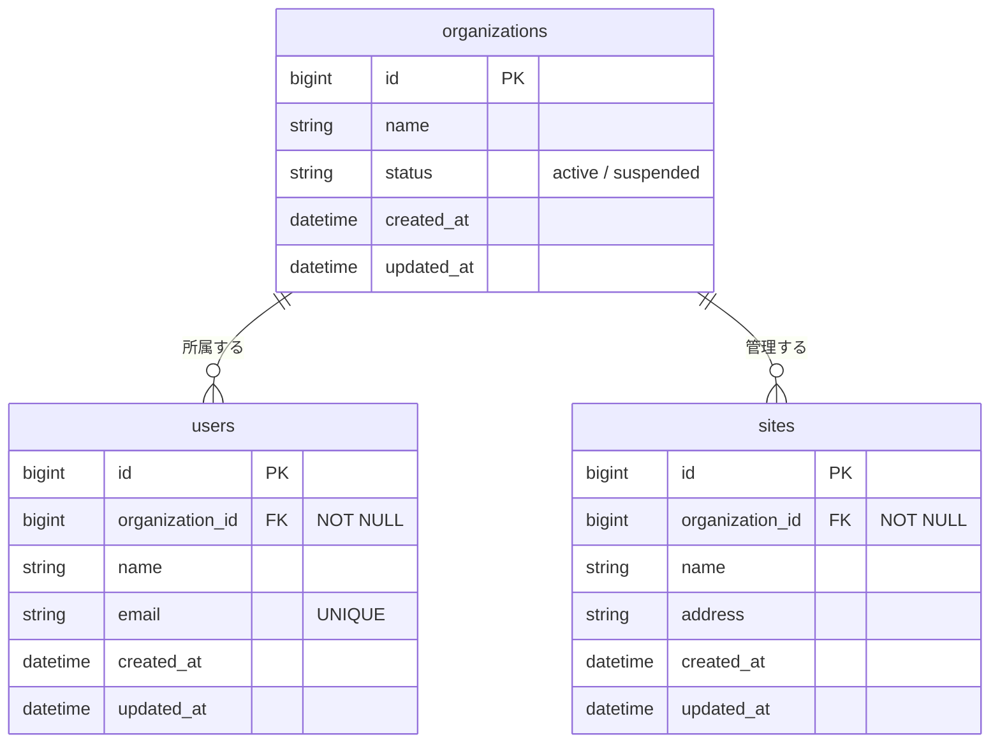

# 現状のスキーマ

課題の題材となるサービスの、現在のデータ構造です。
変更要求を受ける前の状態を表しています。

## ER図



## テーブル定義

```sql
CREATE TABLE organizations (
  id          BIGINT PRIMARY KEY,
  name        VARCHAR(255) NOT NULL,
  status      VARCHAR(32)  NOT NULL DEFAULT 'active',  -- active / suspended
  created_at  TIMESTAMP    NOT NULL,
  updated_at  TIMESTAMP    NOT NULL
);

CREATE TABLE users (
  id               BIGINT PRIMARY KEY,
  organization_id  BIGINT       NOT NULL REFERENCES organizations(id),
  name             VARCHAR(255) NOT NULL,
  email            VARCHAR(255) NOT NULL UNIQUE,
  created_at       TIMESTAMP    NOT NULL,
  updated_at       TIMESTAMP    NOT NULL
);
CREATE INDEX idx_users_organization_id ON users(organization_id);

CREATE TABLE sites (
  id               BIGINT PRIMARY KEY,
  organization_id  BIGINT       NOT NULL REFERENCES organizations(id),
  name             VARCHAR(255) NOT NULL,
  address          VARCHAR(255),
  created_at       TIMESTAMP    NOT NULL,
  updated_at       TIMESTAMP    NOT NULL
);
CREATE INDEX idx_sites_organization_id ON sites(organization_id);
```

## 前提となる事実

- 利用者は必ず一つの組織に所属します。`users.organization_id` はNOT NULLです
- `email` は全組織を通じて一意です。同じ人が別の組織に登録されることは、現状の構造では想定していません
- 本番の `users` は数十万件、`organizations` は数千件、`sites` は数万件あります
- 組織の `status` が `suspended` のとき、その組織の利用者はAPIを呼べません（`docs/current/api.md` を参照）

## サンプルデータ

| organizations.id | name | status |
| --- | --- | --- |
| 1 | 株式会社A | active |
| 2 | 株式会社B | active |

| users.id | organization_id | name | email |
| --- | --- | --- | --- |
| 1 | 1 | 山田 | yamada@example.com |
| 2 | 1 | 佐藤 | sato@example.com |
| 3 | 2 | 鈴木 | suzuki@example.com |

| sites.id | organization_id | name |
| --- | --- | --- |
| 1 | 1 | A社 本社 |
| 2 | 2 | B社 大阪支店 |
